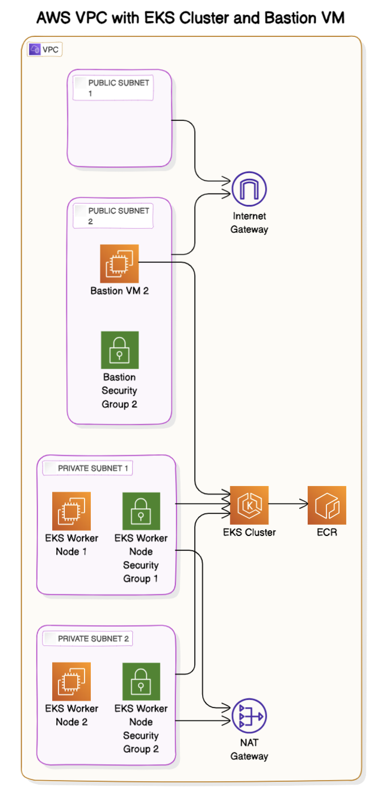

# Fortune API Deployment

This document outlines the steps to containerize, set up a runtime, and deploy the Fortune API application using AWS EKS with Terraform.

## Prerequisites

Ensure the following tools are configured on your local machine:

- Docker
- AWS CLI
- Terraform
- kubectl

## Steps

### 1. Containerization

#### Containerize the Application

1. **Clone the Repository**

   ```bash
   git clone https://github.com/arifazeem/devops-fortune.git
   cd devops-fortune

2. **Build the Docker Image**

   ```bash
   docker build -t devops-fortune .
   we will push Push Docker Image to ECR once we create ECR repository via terraform script
   
3. **Push Docker Image to ECR**

   ```bash
   aws ecr get-login-password --region your-region | docker login --username AWS --password-stdin your-account-id.dkr.ecr.your-region.amazonaws.com
   docker tag fortune-api:latest your-account-id.dkr.ecr.your-region.amazonaws.com/fortune-api:latest
   docker push your-account-id.dkr.ecr.your-region.amazonaws.com/fortune-api:latest

### 2. Setup a Runtime
For this guide, we'll use AWS EKS.

####   Deploy Using Terraform
      
      The Terrform script will create VPC with 4 subnets. 2 Subnets will be private be private and 2 subnets will be public.
      In Private subnet EKS cluster and worker node will be created. In public Subnet Bastion VM will be created though which
      we will be accessing EKS cluster

      Initialize and Apply Terraform Configuration
      cd terraform
      terraform init
      terraform apply



sh
Copy code
aws eks --region your-region update-kubeconfig --name eks-cluster


sh
Copy code
aws ecr get-login-password --region your-region | docker login --username AWS --password-stdin your-account-id.dkr.ecr.your-region.amazonaws.com
docker tag fortune-api:latest your-account-id.dkr.ecr.your-region.amazonaws.com/fortune-api:latest
docker push your-account-id.dkr.ecr.your-region.amazonaws.com/fortune-api:latest

